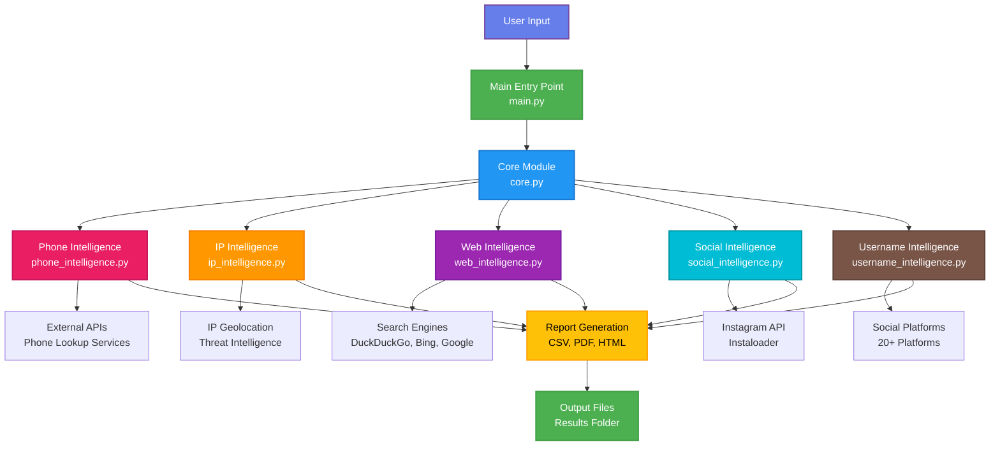
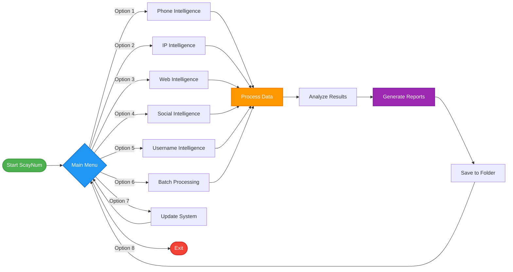
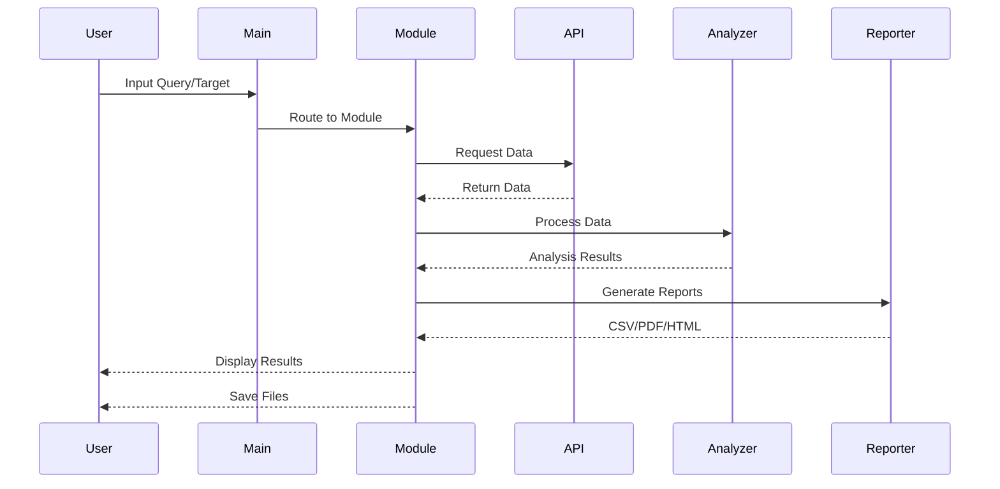

# 🚀 ScayNum - Advanced OSINT Intelligence Platform

[](https://python.org)
[](LICENSE)
[](https://github.com/Scayar/ScayNum)
[](https://github.com/Scayar/ScayNum)
[](https://scayar.com)

> **🔍 Advanced Open Source Intelligence Platform for Digital Investigations**

**🌟 Built with ❤️ by [Scayar](https://scayar.com)**

---

## 📋 Table of Contents

- [Overview](#-overview)
- [Architecture](#-architecture)
- [Features](#-features)
- [Installation](#-installation)
- [Usage](#-usage)
- [Modules](#-modules)
- [Contributing](#-contributing)
- [License](#-license)
- [Credits](#-credits)

---

## 🎯 Overview

ScayNum is a **comprehensive OSINT (Open Source Intelligence)** platform designed for digital investigators, security researchers, and cybersecurity professionals. It provides advanced capabilities for gathering intelligence from various digital sources through an intuitive, modern interface.

### Key Capabilities

- 📱 **Phone Number Intelligence** - Comprehensive analysis and social media discovery
- 🌐 **IP Address Intelligence** - Network analysis and threat detection
- 🔍 **Web Search Intelligence** - Multi-engine search with smart categorization
- 📸 **Social Media Intelligence** - Instagram profile analysis and monitoring
- 👤 **Username Intelligence** - Cross-platform username verification

---

## 🏗️ Architecture

### System Architecture Diagram



### Module Flow Diagram



### Data Flow Diagram



---

## ✨ Features

### 📱 Phone Intelligence Module

**Comprehensive Phone Number Analysis:**
- ✅ Social Media Discovery - Find profiles across 50+ platforms
- ✅ Data Breach Verification - Check against 100+ known breaches
- ✅ Messaging Platform Detection - Identify WhatsApp, Telegram, Signal usage
- ✅ Geolocation Intelligence - Precise location mapping with coordinates
- ✅ Owner Information Estimation - Name and demographic analysis
- ✅ Interactive Geographic Visualization - Real-time map integration
- ✅ Risk Assessment Engine - Threat level evaluation
- ✅ Batch Processing Capability - Process thousands of numbers via CSV

**Perfect for:** Digital forensics, background checks, threat intelligence

---

### 🌐 IP Intelligence Module

**Advanced IP Address Intelligence:**
- ✅ Comprehensive IP Profiling - Country, city, ISP, organization details
- ✅ Reverse DNS Resolution - Complete domain name analysis
- ✅ DNS Records Intelligence - A, AAAA, MX, TXT, NS records
- ✅ Threat Intelligence Integration - Check against 50+ threat databases
- ✅ Network Infrastructure Analysis - ASN, hosting, proxy detection
- ✅ Geographic Visualization - Interactive mapping with coordinates
- ✅ Security Risk Assessment - Automated threat evaluation
- ✅ Bulk IP Analysis - Process multiple IPs simultaneously

**Perfect for:** Network security, incident response, threat hunting

---

### 🔍 Web Intelligence Module

**Advanced Web Search Intelligence:**
- ✅ Multi-Engine Search - DuckDuckGo, Bing, Google with fallback
- ✅ Smart Result Categorization - Automatic content classification
- ✅ Social Media Profile Detection - Identify social accounts
- ✅ Contact Information Extraction - Emails, phones, addresses
- ✅ Threat Intelligence Analysis - Security indicator detection
- ✅ Comprehensive Reporting - CSV, PDF, HTML with visualizations
- ✅ Advanced Filtering - Relevance and source-based filtering
- ✅ Real-time Data Processing - Live result analysis

**Perfect for:** Digital investigations, competitive intelligence, research

---

### 📸 Social Intelligence Module

**Instagram Profile Intelligence:**
- ✅ Comprehensive Profile Analysis - Bio, followers, posts, engagement
- ✅ Fake Account Detection - AI-powered suspicious profile identification
- ✅ Engagement Rate Calculation - Automated metrics analysis
- ✅ Hashtag Intelligence - Popular hashtags and trend analysis
- ✅ Real-time Monitoring - Live profile tracking capabilities
- ✅ Visual Report Generation - Beautiful PDF/HTML reports
- ✅ Content Analysis - Post patterns and content categorization
- ✅ Network Mapping - Connection and interaction analysis

**Perfect for:** Social media investigations, influencer analysis, brand protection

---

### 👤 Username Intelligence Module

**Cross-Platform Username Intelligence:**
- ✅ Multi-Platform Verification - Check 20+ major platforms
- ✅ Visibility Score Calculation - Online presence quantification
- ✅ Risk Level Assessment - Automated security evaluation
- ✅ Privacy Recommendations - Personalized protection advice
- ✅ Comprehensive Reporting - Detailed CSV, PDF, HTML reports
- ✅ Real-time Platform Checking - Live availability verification
- ✅ Brand Protection Analysis - Username squatting detection
- ✅ Digital Footprint Mapping - Complete online presence overview

**Perfect for:** Brand protection, identity verification, digital footprint analysis

---

## 🚀 Installation

### Prerequisites

- Python 3.7 or higher
- pip (Python package manager)
- Git (for updates)

### Quick Installation

#### Windows

**Method 1: One-Click Installation (Recommended)**
```cmd
# Download and extract ScayNum
# Double-click on run_ScayNum.bat
```

**Method 2: PowerShell Installation**
```powershell
# Clone the repository
git clone https://github.com/Scayar/ScayNum.git
cd ScayNum

# Install dependencies
.\run_ScayNum.ps1 -Install

# Launch ScayNum
.\run_ScayNum.ps1
```

**Method 3: Command Prompt Installation**
```cmd
# Clone the repository
git clone https://github.com/Scayar/ScayNum.git
cd ScayNum

# Install dependencies
pip install -r requirements.txt

# Launch ScayNum
python main.py
```

#### macOS

**Method 1: Terminal Installation (Recommended)**
```bash
# Clone the repository
git clone https://github.com/Scayar/ScayNum.git
cd ScayNum

# Make script executable
chmod +x run_ScayNum.sh

# Install dependencies
./run_ScayNum.sh install

# Launch ScayNum
./run_ScayNum.sh
```

**Method 2: Makefile Installation**
```bash
# Clone the repository
git clone https://github.com/Scayar/ScayNum.git
cd ScayNum

# Install and launch
make install && make run
```

#### Linux

**Method 1: Quick Installation**
```bash
# Clone the repository
git clone https://github.com/Scayar/ScayNum.git
cd ScayNum

# Install dependencies
sudo apt update
sudo apt install python3-pip
pip3 install -r requirements.txt

# Launch ScayNum
python3 main.py
```

---

## 💻 Usage

### Basic Usage

1. **Launch ScayNum:**
   ```bash
   python main.py
   ```

2. **Select a module from the menu:**
   - `1` - Phone Number OSINT
   - `2` - IP Address Lookup
   - `3` - Web Search
   - `4` - Instagram OSINT
   - `5` - Username Search
   - `6` - Batch Processing
   - `7` - Update ScayNum
   - `8` - Exit

3. **Follow the prompts** to enter your query

4. **View results** in the terminal and check the generated reports in the results folder

### Examples

#### Phone Intelligence Example
```bash
python main.py
# Select option 1: Phone Number OSINT
# Enter phone number: +1234567890
```

#### IP Intelligence Example
```bash
python main.py
# Select option 2: IP Address Lookup
# Enter IP address: 8.8.8.8
```

#### Web Search Example
```bash
python main.py
# Select option 3: Web Search
# Enter query: "John Doe cybersecurity"
```

#### Batch Processing Example
```bash
# Create CSV file with targets
echo "phone_number" > phones.csv
echo "+1234567890" >> phones.csv
echo "+9876543210" >> phones.csv

# Run batch processing
python main.py
# Select option 6: Batch Processing
# Select option 1: Phone Numbers (CSV)
# Enter file path: phones.csv
```

---

## 🛠️ Project Structure

```
ScayNum/
├── main.py                    # 🚀 Main entry point
├── scripts/
│   ├── core.py               # 🧠 Core application logic
│   ├── phone_intelligence.py # 📱 Phone OSINT module
│   ├── ip_intelligence.py    # 🌐 IP intelligence module
│   ├── web_intelligence.py   # 🔍 Web search module
│   ├── social_intelligence.py # 📸 Social media module
│   └── username_intelligence.py # 👤 Username search module
├── requirements.txt          # 📦 Dependencies
├── setup.py                 # ⚙️ Package configuration
├── README.md               # 📖 Documentation
├── LICENSE                 # 📄 License information
├── Makefile               # 🔧 Build automation
├── .gitignore            # 🚫 Git ignore rules
├── run_ScayNum.bat        # 🪟 Windows launcher
├── run_ScayNum.ps1        # 💻 PowerShell launcher
└── run_ScayNum.sh         # 🐧 Shell launcher
```

---

## 📦 Dependencies

### Core Dependencies

- **pyfiglet** - ASCII art and banners
- **colorama** - Terminal color support
- **tabulate** - Beautiful table formatting
- **requests** - HTTP client library
- **beautifulsoup4** - HTML parsing
- **phonenumbers** - Phone number validation
- **folium** - Interactive maps
- **instaloader** - Instagram API
- **fpdf** - PDF generation
- **jinja2** - HTML templating
- **dnspython** - DNS resolution
- **googlesearch-python** - Google search integration

Install all dependencies:
```bash
pip install -r requirements.txt
```

---

## 🛡️ Security & Privacy

### Privacy Features

- ✅ **No Data Storage** - All data processed locally
- ✅ **Encrypted Communications** - Secure API connections
- ✅ **Rate Limiting** - Respectful API usage
- ✅ **User Agent Rotation** - Anti-detection measures
- ✅ **Proxy Support** - Anonymous browsing capabilities

### Legal Compliance

⚠️ **Important Notice:**
- This tool is for **educational and research purposes only**
- Users are responsible for complying with local laws and regulations
- Respect privacy and terms of service of target platforms
- Use responsibly and ethically

---

## 🤝 Contributing

We welcome contributions from the community! Here's how you can help:

### 🐛 Bug Reports
- Use the [Issues](https://github.com/Scayar/ScayNum/issues) page
- Provide detailed error descriptions
- Include system information and logs

### 💡 Feature Requests
- Submit feature ideas via Issues
- Describe use cases and benefits
- Consider implementation complexity

### 🔧 Code Contributions
1. Fork the repository
2. Create a feature branch
3. Make your changes
4. Add tests if applicable
5. Submit a pull request

### 📚 Documentation
- Improve README sections
- Add code comments
- Create tutorials and guides

---

## 📄 License

This project is licensed under the MIT License - see the [LICENSE](LICENSE) file for details.

---

## 📞 Credits

### Author

**Scayar**

- 🌐 **Website:** [Scayar.com](https://scayar.com)
- 📧 **Email:** Scayar.exe@gmail.com
- 💬 **Telegram:** [@im_scayar](https://t.me/im_scayar)
- ☕️ **Buy Me a Coffee:** [buymeacoffee.com/scayar](https://buymeacoffee.com/scayar)

### Special Thanks

- **Open Source Community** - For amazing libraries and tools
- **OSINT Community** - For knowledge sharing and collaboration
- **Contributors** - For code improvements and bug fixes
- **Users** - For feedback and feature suggestions

### Inspiration

- **OSINT Framework** - For comprehensive intelligence gathering
- **Maltego** - For graph-based intelligence visualization
- **Shodan** - For internet-wide intelligence gathering
- **TheHarvester** - For email and domain intelligence

---

## 🙏 Acknowledgments

This project would not be possible without the amazing open-source community and the tools they've created. Thank you to all the developers and contributors who make projects like this possible.

---

## 🌟 Star History

If you find this project helpful, please consider giving it a star ⭐

[](https://github.com/Scayar/ScayNum)
[](https://github.com/Scayar/ScayNum)
[](https://github.com/Scayar/ScayNum)

---

**Made with ❤️ by [Scayar](https://scayar.com)**

[](https://scayar.com)
[](https://t.me/im_scayar)
[](mailto:Scayar.exe@gmail.com)
[](https://buymeacoffee.com/scayar)

---

## 📊 Statistics


