# 🚀 ScayNum - Advanced OSINT Intelligence Platform

[](https://python.org)
[](LICENSE)
[](https://github.com/Scayar/ScayNum)
[](https://github.com/Scayar/ScayNum)
[](https://scayar.com)

> **🔍 Advanced Open Source Intelligence Platform for Digital Investigations**

**🌟 Built with ❤️ by [Scayar](https://scayar.com)**

---

## 📋 Table of Contents

- [Overview](#-overview)
- [Architecture](#-architecture)
- [Features](#-features)
- [Installation](#-installation)
- [Usage](#-usage)
- [Modules](#-modules)
- [Contributing](#-contributing)
- [License](#-license)
- [Credits](#-credits)

---

## 🎯 Overview

ScayNum is a **comprehensive OSINT (Open Source Intelligence)** platform designed for digital investigators, security researchers, and cybersecurity professionals. It provides advanced capabilities for gathering intelligence from various digital sources through an intuitive, modern interface.

### Key Capabilities

- 📱 **Phone Number Intelligence** - Comprehensive analysis and social media discovery
- 🌐 **IP Address Intelligence** - Network analysis and threat detection
- 🔍 **Web Search Intelligence** - Multi-engine search with smart categorization
- 📸 **Social Media Intelligence** - Instagram profile analysis and monitoring
- 👤 **Username Intelligence** - Cross-platform username verification

---

## 🏗️ Architecture & How It Works

### Complete System Workflow

```mermaid
flowchart TD
    Start([🚀 User Launches ScayNum]) --> Init[📋 Initialization<br/>Load Modules & Dependencies]
    Init --> Banner[🎨 Display Banner<br/>& Welcome Screen]
    Banner --> UpdateCheck{🔄 Check for<br/>Updates?}
    
    UpdateCheck -->|Yes| Update[📦 Update System<br/>Git Pull & Dependencies]
    UpdateCheck -->|No| Menu
    Update --> Menu[📋 Main Menu<br/>Display Options]
    
    Menu --> Option1[1️⃣ Phone Intelligence]
    Menu --> Option2[2️⃣ IP Intelligence]
    Menu --> Option3[3️⃣ Web Intelligence]
    Menu --> Option4[4️⃣ Social Intelligence]
    Menu --> Option5[5️⃣ Username Intelligence]
    Menu --> Option6[6️⃣ Batch Processing]
    Menu --> Option7[7️⃣ Update System]
    Menu --> Option8[8️⃣ Exit]
    
    Option1 --> Input1[📞 Get Phone Number Input<br/>Format: +CountryCode Number]
    Input1 --> Validate1{✅ Validate<br/>Phone Format?}
    Validate1 -->|Invalid| Error1[❌ Show Error<br/>Return to Menu]
    Validate1 -->|Valid| Process1[🔍 Process Phone Intelligence]
    
    Option2 --> Input2[🌐 Get IP Address Input<br/>Format: IPv4 or IPv6]
    Input2 --> Validate2{✅ Validate<br/>IP Format?}
    Validate2 -->|Invalid| Error2[❌ Show Error<br/>Return to Menu]
    Validate2 -->|Valid| Process2[🔍 Process IP Intelligence]
    
    Option3 --> Input3[🔎 Get Search Query Input]
    Input3 --> Process3[🔍 Process Web Intelligence]
    
    Option4 --> Input4[📸 Get Instagram Username]
    Input4 --> Process4[🔍 Process Social Intelligence]
    
    Option5 --> Input5[👤 Get Username to Search]
    Input5 --> Process5[🔍 Process Username Intelligence]
    
    Option6 --> BatchMenu[📊 Batch Processing Menu]
    BatchMenu --> BatchType{Select Type}
    BatchType -->|Phones| Batch1[📞 Batch Phone Processing<br/>Read CSV File]
    BatchType -->|IPs| Batch2[🌐 Batch IP Processing<br/>Read CSV File]
    Batch1 --> Process1
    Batch2 --> Process2
    
    Process1 --> Collect1[📡 Collect Data from:<br/>• Phone APIs<br/>• Social Media<br/>• Data Breach DBs<br/>• Geolocation Services]
    Process2 --> Collect2[📡 Collect Data from:<br/>• IP Geolocation APIs<br/>• Threat Intelligence<br/>• DNS Servers<br/>• Network Analysis]
    Process3 --> Collect3[📡 Collect Data from:<br/>• DuckDuckGo<br/>• Bing Search<br/>• Google Fallback]
    Process4 --> Collect4[📡 Collect Data from:<br/>• Instagram API<br/>• Profile Analysis<br/>• Post Analytics]
    Process5 --> Collect5[📡 Collect Data from:<br/>• 20+ Social Platforms<br/>• Platform APIs<br/>• Username Checks]
    
    Collect1 --> Analyze1[🧠 Analyze Data:<br/>• Risk Assessment<br/>• Pattern Recognition<br/>• Threat Detection]
    Collect2 --> Analyze2[🧠 Analyze Data:<br/>• Network Analysis<br/>• Threat Indicators<br/>• Risk Scoring]
    Collect3 --> Analyze3[🧠 Analyze Data:<br/>• Result Categorization<br/>• Relevance Ranking<br/>• Content Extraction]
    Collect4 --> Analyze4[🧠 Analyze Data:<br/>• Engagement Metrics<br/>• Fake Account Detection<br/>• Content Analysis]
    Collect5 --> Analyze5[🧠 Analyze Data:<br/>• Visibility Scoring<br/>• Privacy Assessment<br/>• Risk Evaluation]
    
    Analyze1 --> Display1[📺 Display Results<br/>Terminal Output]
    Analyze2 --> Display2[📺 Display Results<br/>Terminal Output]
    Analyze3 --> Display3[📺 Display Results<br/>Terminal Output]
    Analyze4 --> Display4[📺 Display Results<br/>Terminal Output]
    Analyze5 --> Display5[📺 Display Results<br/>Terminal Output]
    
    Display1 --> Report1[📄 Generate Reports]
    Display2 --> Report2[📄 Generate Reports]
    Display3 --> Report3[📄 Generate Reports]
    Display4 --> Report4[📄 Generate Reports]
    Display5 --> Report5[📄 Generate Reports]
    
    Report1 --> Save1[💾 Save to Results Folder:<br/>• CSV Report<br/>• PDF Report<br/>• HTML Report<br/>• Interactive Map]
    Report2 --> Save2[💾 Save to Results Folder:<br/>• CSV Report<br/>• PDF Report<br/>• HTML Report<br/>• Interactive Map]
    Report3 --> Save3[💾 Save to Results Folder:<br/>• CSV Report<br/>• PDF Report<br/>• HTML Report]
    Report4 --> Save4[💾 Save to Results Folder:<br/>• CSV Report<br/>• PDF Report<br/>• HTML Report<br/>• Profile Images]
    Report5 --> Save5[💾 Save to Results Folder:<br/>• CSV Report<br/>• PDF Report<br/>• HTML Report]
    
    Save1 --> Continue{🔄 Continue?}
    Save2 --> Continue
    Save3 --> Continue
    Save4 --> Continue
    Save5 --> Continue
    Error1 --> Continue
    Error2 --> Continue
    
    Continue -->|Yes| Menu
    Continue -->|No| End([👋 Exit ScayNum])
    Option7 --> Update
    Option8 --> End
    
    style Start fill:#667eea,stroke:#764ba2,stroke-width:3px,color:#fff
    style Menu fill:#2196F3,stroke:#1976D2,stroke-width:3px,color:#fff
    style Process1 fill:#E91E63,stroke:#C2185B,stroke-width:2px,color:#fff
    style Process2 fill:#FF9800,stroke:#F57C00,stroke-width:2px,color:#fff
    style Process3 fill:#9C27B0,stroke:#7B1FA2,stroke-width:2px,color:#fff
    style Process4 fill:#00BCD4,stroke:#0097A7,stroke-width:2px,color:#fff
    style Process5 fill:#795548,stroke:#5D4037,stroke-width:2px,color:#fff
    style Analyze1 fill:#FFC107,stroke:#FFA000,stroke-width:2px,color:#000
    style Analyze2 fill:#FFC107,stroke:#FFA000,stroke-width:2px,color:#000
    style Analyze3 fill:#FFC107,stroke:#FFA000,stroke-width:2px,color:#000
    style Analyze4 fill:#FFC107,stroke:#FFA000,stroke-width:2px,color:#000
    style Analyze5 fill:#FFC107,stroke:#FFA000,stroke-width:2px,color:#000
    style Save1 fill:#4CAF50,stroke:#45a049,stroke-width:2px,color:#fff
    style Save2 fill:#4CAF50,stroke:#45a049,stroke-width:2px,color:#fff
    style Save3 fill:#4CAF50,stroke:#45a049,stroke-width:2px,color:#fff
    style Save4 fill:#4CAF50,stroke:#45a049,stroke-width:2px,color:#fff
    style Save5 fill:#4CAF50,stroke:#45a049,stroke-width:2px,color:#fff
    style End fill:#f44336,stroke:#d32f2f,stroke-width:3px,color:#fff
```



### Data Processing Pipeline

```mermaid
graph LR
    subgraph Input["📥 INPUT LAYER"]
        A1[Phone Number<br/>+1234567890]
        A2[IP Address<br/>8.8.8.8]
        A3[Search Query<br/>"John Doe"]
        A4[Instagram Username<br/>@username]
        A5[Username<br/>username123]
    end
    
    subgraph Validation["✅ VALIDATION LAYER"]
        B1[Format Validation<br/>Phone Number Parser]
        B2[Format Validation<br/>IP Address Validator]
        B3[Query Processing<br/>Smart Variations]
        B4[Username Validation<br/>Format Check]
        B5[Username Validation<br/>Format Check]
    end
    
    subgraph Collection["📡 DATA COLLECTION LAYER"]
        C1[API Calls<br/>Phone Lookup Services<br/>Social Media APIs<br/>Data Breach DBs]
        C2[API Calls<br/>IP Geolocation<br/>Threat Intelligence<br/>DNS Resolution]
        C3[Web Scraping<br/>DuckDuckGo Search<br/>Bing Search<br/>Google Fallback]
        C4[Instagram API<br/>Instaloader<br/>Profile Data<br/>Post Analytics]
        C5[Platform Checks<br/>20+ Social Platforms<br/>URL Verification<br/>Status Checking]
    end
    
    subgraph Processing["🧠 ANALYSIS LAYER"]
        D1[Risk Assessment<br/>Social Media Presence<br/>Breach Detection<br/>Geolocation Analysis]
        D2[Threat Analysis<br/>Risk Scoring<br/>Network Analysis<br/>DNS Records]
        D3[Result Ranking<br/>Categorization<br/>Relevance Scoring<br/>Content Extraction]
        D4[Engagement Analysis<br/>Fake Detection<br/>Hashtag Analysis<br/>Content Patterns]
        D5[Visibility Scoring<br/>Privacy Assessment<br/>Risk Evaluation<br/>Footprint Mapping]
    end
    
    subgraph Output["📤 OUTPUT LAYER"]
        E1[Terminal Display<br/>Colored Output<br/>Formatted Tables]
        E2[CSV Reports<br/>Spreadsheet Format<br/>Data Export]
        E3[PDF Reports<br/>Professional Docs<br/>Printable Format]
        E4[HTML Reports<br/>Interactive Web<br/>Visualizations]
        E5[Interactive Maps<br/>Geolocation Display<br/>Coordinate Mapping]
    end
    
    A1 --> B1 --> C1 --> D1 --> E1
    A1 --> B1 --> C1 --> D1 --> E2
    A1 --> B1 --> C1 --> D1 --> E3
    A1 --> B1 --> C1 --> D1 --> E4
    A1 --> B1 --> C1 --> D1 --> E5
    
    A2 --> B2 --> C2 --> D2 --> E1
    A2 --> B2 --> C2 --> D2 --> E2
    A2 --> B2 --> C2 --> D2 --> E3
    A2 --> B2 --> C2 --> D2 --> E4
    A2 --> B2 --> C2 --> D2 --> E5
    
    A3 --> B3 --> C3 --> D3 --> E1
    A3 --> B3 --> C3 --> D3 --> E2
    A3 --> B3 --> C3 --> D3 --> E3
    A3 --> B3 --> C3 --> D3 --> E4
    
    A4 --> B4 --> C4 --> D4 --> E1
    A4 --> B4 --> C4 --> D4 --> E2
    A4 --> B4 --> C4 --> D4 --> E3
    A4 --> B4 --> C4 --> D4 --> E4
    
    A5 --> B5 --> C5 --> D5 --> E1
    A5 --> B5 --> C5 --> D5 --> E2
    A5 --> B5 --> C5 --> D5 --> E3
    A5 --> B5 --> C5 --> D5 --> E4
    
    style Input fill:#E3F2FD,stroke:#1976D2,stroke-width:2px
    style Validation fill:#FFF3E0,stroke:#F57C00,stroke-width:2px
    style Collection fill:#F3E5F5,stroke:#7B1FA2,stroke-width:2px
    style Processing fill:#E8F5E9,stroke:#388E3C,stroke-width:2px
    style Output fill:#FFEBEE,stroke:#C62828,stroke-width:2px
```

### Detailed System Architecture


### Complete Data Flow Sequence


---

## ✨ Features

### 📱 Phone Intelligence Module

**Comprehensive Phone Number Analysis:**
- ✅ Social Media Discovery - Find profiles across 50+ platforms
- ✅ Data Breach Verification - Check against 100+ known breaches
- ✅ Messaging Platform Detection - Identify WhatsApp, Telegram, Signal usage
- ✅ Geolocation Intelligence - Precise location mapping with coordinates
- ✅ Owner Information Estimation - Name and demographic analysis
- ✅ Interactive Geographic Visualization - Real-time map integration
- ✅ Risk Assessment Engine - Threat level evaluation
- ✅ Batch Processing Capability - Process thousands of numbers via CSV

**Perfect for:** Digital forensics, background checks, threat intelligence

---

### 🌐 IP Intelligence Module

**Advanced IP Address Intelligence:**
- ✅ Comprehensive IP Profiling - Country, city, ISP, organization details
- ✅ Reverse DNS Resolution - Complete domain name analysis
- ✅ DNS Records Intelligence - A, AAAA, MX, TXT, NS records
- ✅ Threat Intelligence Integration - Check against 50+ threat databases
- ✅ Network Infrastructure Analysis - ASN, hosting, proxy detection
- ✅ Geographic Visualization - Interactive mapping with coordinates
- ✅ Security Risk Assessment - Automated threat evaluation
- ✅ Bulk IP Analysis - Process multiple IPs simultaneously

**Perfect for:** Network security, incident response, threat hunting

---

### 🔍 Web Intelligence Module

**Advanced Web Search Intelligence:**
- ✅ Multi-Engine Search - DuckDuckGo, Bing, Google with fallback
- ✅ Smart Result Categorization - Automatic content classification
- ✅ Social Media Profile Detection - Identify social accounts
- ✅ Contact Information Extraction - Emails, phones, addresses
- ✅ Threat Intelligence Analysis - Security indicator detection
- ✅ Comprehensive Reporting - CSV, PDF, HTML with visualizations
- ✅ Advanced Filtering - Relevance and source-based filtering
- ✅ Real-time Data Processing - Live result analysis

**Perfect for:** Digital investigations, competitive intelligence, research

---

### 📸 Social Intelligence Module

**Instagram Profile Intelligence:**
- ✅ Comprehensive Profile Analysis - Bio, followers, posts, engagement
- ✅ Fake Account Detection - AI-powered suspicious profile identification
- ✅ Engagement Rate Calculation - Automated metrics analysis
- ✅ Hashtag Intelligence - Popular hashtags and trend analysis
- ✅ Real-time Monitoring - Live profile tracking capabilities
- ✅ Visual Report Generation - Beautiful PDF/HTML reports
- ✅ Content Analysis - Post patterns and content categorization
- ✅ Network Mapping - Connection and interaction analysis

**Perfect for:** Social media investigations, influencer analysis, brand protection

---

### 👤 Username Intelligence Module

**Cross-Platform Username Intelligence:**
- ✅ Multi-Platform Verification - Check 20+ major platforms
- ✅ Visibility Score Calculation - Online presence quantification
- ✅ Risk Level Assessment - Automated security evaluation
- ✅ Privacy Recommendations - Personalized protection advice
- ✅ Comprehensive Reporting - Detailed CSV, PDF, HTML reports
- ✅ Real-time Platform Checking - Live availability verification
- ✅ Brand Protection Analysis - Username squatting detection
- ✅ Digital Footprint Mapping - Complete online presence overview

**Perfect for:** Brand protection, identity verification, digital footprint analysis

---

## 🚀 Installation

### Prerequisites

- Python 3.7 or higher
- pip (Python package manager)
- Git (for updates)

### Quick Installation

#### Windows

**Method 1: One-Click Installation (Recommended)**
```cmd
# Download and extract ScayNum
# Double-click on run_ScayNum.bat
```

**Method 2: PowerShell Installation**
```powershell
# Clone the repository
git clone https://github.com/Scayar/ScayNum.git
cd ScayNum

# Install dependencies
.\run_ScayNum.ps1 -Install

# Launch ScayNum
.\run_ScayNum.ps1
```

**Method 3: Command Prompt Installation**
```cmd
# Clone the repository
git clone https://github.com/Scayar/ScayNum.git
cd ScayNum

# Install dependencies
pip install -r requirements.txt

# Launch ScayNum
python main.py
```

#### macOS

**Method 1: Terminal Installation (Recommended)**
```bash
# Clone the repository
git clone https://github.com/Scayar/ScayNum.git
cd ScayNum

# Make script executable
chmod +x run_ScayNum.sh

# Install dependencies
./run_ScayNum.sh install

# Launch ScayNum
./run_ScayNum.sh
```

**Method 2: Makefile Installation**
```bash
# Clone the repository
git clone https://github.com/Scayar/ScayNum.git
cd ScayNum

# Install and launch
make install && make run
```

#### Linux

**Method 1: Quick Installation**
```bash
# Clone the repository
git clone https://github.com/Scayar/ScayNum.git
cd ScayNum

# Install dependencies
sudo apt update
sudo apt install python3-pip
pip3 install -r requirements.txt

# Launch ScayNum
python3 main.py
```

---

## 💻 Usage

### Basic Usage

1. **Launch ScayNum:**
   ```bash
   python main.py
   ```

2. **Select a module from the menu:**
   - `1` - Phone Number OSINT
   - `2` - IP Address Lookup
   - `3` - Web Search
   - `4` - Instagram OSINT
   - `5` - Username Search
   - `6` - Batch Processing
   - `7` - Update ScayNum
   - `8` - Exit

3. **Follow the prompts** to enter your query

4. **View results** in the terminal and check the generated reports in the results folder

### Examples

#### Phone Intelligence Example
```bash
python main.py
# Select option 1: Phone Number OSINT
# Enter phone number: +1234567890
```

#### IP Intelligence Example
```bash
python main.py
# Select option 2: IP Address Lookup
# Enter IP address: 8.8.8.8
```

#### Web Search Example
```bash
python main.py
# Select option 3: Web Search
# Enter query: "John Doe cybersecurity"
```

#### Batch Processing Example
```bash
# Create CSV file with targets
echo "phone_number" > phones.csv
echo "+1234567890" >> phones.csv
echo "+9876543210" >> phones.csv

# Run batch processing
python main.py
# Select option 6: Batch Processing
# Select option 1: Phone Numbers (CSV)
# Enter file path: phones.csv
```

---

## 🛠️ Project Structure

```
ScayNum/
├── main.py                    # 🚀 Main entry point
├── scripts/
│   ├── core.py               # 🧠 Core application logic
│   ├── phone_intelligence.py # 📱 Phone OSINT module
│   ├── ip_intelligence.py    # 🌐 IP intelligence module
│   ├── web_intelligence.py   # 🔍 Web search module
│   ├── social_intelligence.py # 📸 Social media module
│   └── username_intelligence.py # 👤 Username search module
├── requirements.txt          # 📦 Dependencies
├── setup.py                 # ⚙️ Package configuration
├── README.md               # 📖 Documentation
├── LICENSE                 # 📄 License information
├── Makefile               # 🔧 Build automation
├── .gitignore            # 🚫 Git ignore rules
├── run_ScayNum.bat        # 🪟 Windows launcher
├── run_ScayNum.ps1        # 💻 PowerShell launcher
└── run_ScayNum.sh         # 🐧 Shell launcher
```

---

## 📦 Dependencies

### Core Dependencies

- **pyfiglet** - ASCII art and banners
- **colorama** - Terminal color support
- **tabulate** - Beautiful table formatting
- **requests** - HTTP client library
- **beautifulsoup4** - HTML parsing
- **phonenumbers** - Phone number validation
- **folium** - Interactive maps
- **instaloader** - Instagram API
- **fpdf** - PDF generation
- **jinja2** - HTML templating
- **dnspython** - DNS resolution
- **googlesearch-python** - Google search integration

Install all dependencies:
```bash
pip install -r requirements.txt
```

---

## 🛡️ Security & Privacy

### Privacy Features

- ✅ **No Data Storage** - All data processed locally
- ✅ **Encrypted Communications** - Secure API connections
- ✅ **Rate Limiting** - Respectful API usage
- ✅ **User Agent Rotation** - Anti-detection measures
- ✅ **Proxy Support** - Anonymous browsing capabilities

### Legal Compliance

⚠️ **Important Notice:**
- This tool is for **educational and research purposes only**
- Users are responsible for complying with local laws and regulations
- Respect privacy and terms of service of target platforms
- Use responsibly and ethically

---

## 🤝 Contributing

We welcome contributions from the community! Here's how you can help:

### 🐛 Bug Reports
- Use the [Issues](https://github.com/Scayar/ScayNum/issues) page
- Provide detailed error descriptions
- Include system information and logs

### 💡 Feature Requests
- Submit feature ideas via Issues
- Describe use cases and benefits
- Consider implementation complexity

### 🔧 Code Contributions
1. Fork the repository
2. Create a feature branch
3. Make your changes
4. Add tests if applicable
5. Submit a pull request

### 📚 Documentation
- Improve README sections
- Add code comments
- Create tutorials and guides

---

## 📄 License

This project is licensed under the MIT License - see the [LICENSE](LICENSE) file for details.

---

## 📞 Credits

### Author

**Scayar**

- 🌐 **Website:** [Scayar.com](https://scayar.com)
- 📧 **Email:** Scayar.exe@gmail.com
- 💬 **Telegram:** [@im_scayar](https://t.me/im_scayar)
- ☕️ **Buy Me a Coffee:** [buymeacoffee.com/scayar](https://buymeacoffee.com/scayar)

### Special Thanks

- **Open Source Community** - For amazing libraries and tools
- **OSINT Community** - For knowledge sharing and collaboration
- **Contributors** - For code improvements and bug fixes
- **Users** - For feedback and feature suggestions

### Inspiration

- **OSINT Framework** - For comprehensive intelligence gathering
- **Maltego** - For graph-based intelligence visualization
- **Shodan** - For internet-wide intelligence gathering
- **TheHarvester** - For email and domain intelligence

---

## 🙏 Acknowledgments

This project would not be possible without the amazing open-source community and the tools they've created. Thank you to all the developers and contributors who make projects like this possible.

---

## 🌟 Star History

If you find this project helpful, please consider giving it a star ⭐

[](https://github.com/Scayar/ScayNum)
[](https://github.com/Scayar/ScayNum)
[](https://github.com/Scayar/ScayNum)

---

**Made with ❤️ by [Scayar](https://scayar.com)**

[](https://scayar.com)
[](https://t.me/im_scayar)
[](mailto:Scayar.exe@gmail.com)
[](https://buymeacoffee.com/scayar)

---

## 📊 Statistics


